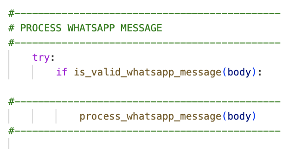
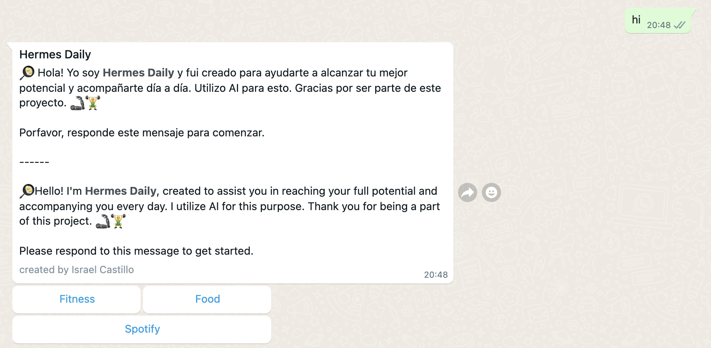
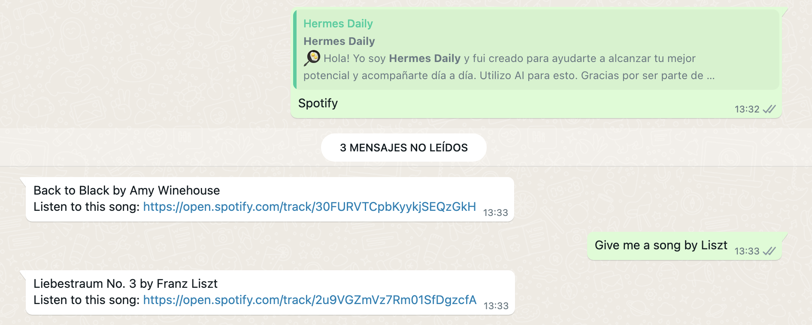
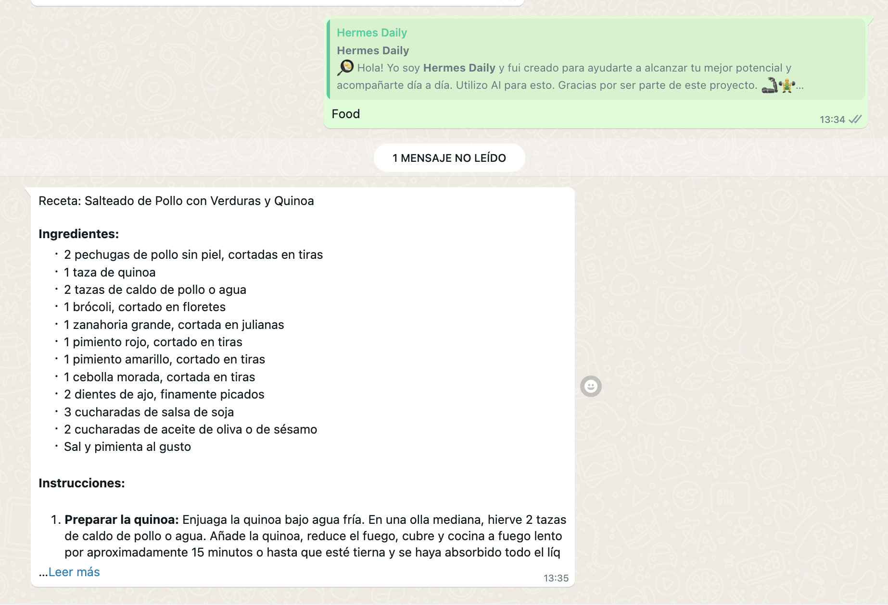
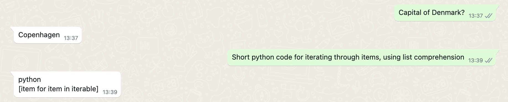
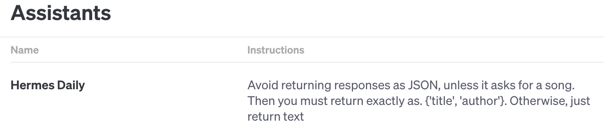
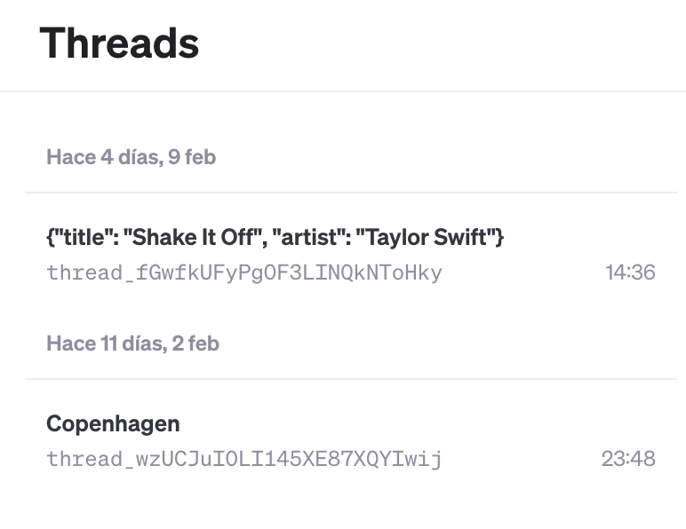

# Hermes Daily

[Github Repo: israelcastilloh](https://github.com/israelcastilloh/hermes-daily) 

Intro
Prerequisites
Project Structure Overview
run.py_
- Concepts
- Summary
views.py_
- Concepts
- Summary
whatsapp_utils.py
- Concepts
- Summary
spotify_retrieve.py
- Summary
openai_service.py
- Concepts
- Summary
To-Do
References
Platforms

---
### Intro


**Hermes Daily** was conceived as an *educational endeavor*, introducing an AI-backed software solution designed to foster a healthy lifestyle. The primary goal of this project was to enhance the capabilities of the **OpenAI platform**, enabling users to interact with their AI assistant seamlessly through **WhatsApp** for a more accessible communication experience.

The vision was to provide users with diverse options to uplift their mood effortlessly. Whether it's obtaining a quick recipe, accessing a convenient gym routine, or exploring the potential for the **AI assistant** to develop a more nuanced understanding of the user through uploaded information. Although this last aspect remains beyond the current scope of our exercise.

Additionally, a noteworthy feature of Hermes Daily is its integration with **Spotify's API**. This functionality empowers users to request any song recommended by OpenAI and receive the corresponding Spotify URL. This innovative addition aims to infuse a musical flair into users' mornings, ensuring a delightful start to their day.

To run the project, simply clone the repository and execute the following command in your terminal:

```
python3 run.py
```

---
{ width=20% } { width=10% } { width=10% } { width=20% }

### Prerequisites
1. Have an OpenAI with enough funds in it
2. Have a Meta Developer account 
3. Have a WhatsApp Business phone number
4. Have an AWS account for Secrets Manager
5. Have a Ngrok Domain account
6. Have a Spotify account and retrieve API credentials
---
### Project Structure Overview
- README.md
- app
  - __init__.py
  - config.py
  - decorators
    - auxiliary.py
    - security.py
  - services
    - openai_service.py
    - spotify_retrieve.py
    - whatsapp_utils.py
  - views.py
- data
  - Hermes Daily.docx
  - config_template.yml
- images
- requirements.txt
- run.py

---
#### run.py_
###### Concepts
- **Flask** is a micro web framework for Python that is lightweight, modular, and easy to use. It is designed to be simple and easy to understand, making it an excellent choice for building small to medium-sized web applications and APIs
- **YAML** is a human-readable data serialization format. It stands out for its simplicity and readability, making it easy for both humans and machines to understand. YAML files are commonly used for configuration files, data exchange between languages with different data structures, and writing data that needs to be human-readable.
- A **webhook** is a mechanism that allows one system or application to send real-time data to another system or application as soon as a specific event occurs. It enables event-driven communication between different services over the web.
###### Summary 
1. Create the Flask app: **Hermes Daily**
2. Load the configuration variables for the app and set the logging configuration
3. The process uses the function `create_config_yaml` to generate a YAML file using a template YAML file. This YAML file is used as a config file for the *ngrok* connection that *pyngrok* library uses to setup the *webhooks* for Meta.
4. Connect to the **Ngrok domain**  created in [ngrok.com](https://ngrok.com/blog-post/free-static-domains-ngrok-users), within our Flask instance python code using *pyngrok library* and terminate this server if the Flask server is terminated
5. For security purposes, the YAML config file is deleted once the ngrok connection is established. All of our sensitive variables are stored using **AWS Secrets Manager** and retrieve across our entire project using `boto3` library.
6. The app is run.


#### views.py_
###### Concepts
- In Flask, a **Blueprint** is a way to organize a group of related views, templates, and static assets under a single name. It helps modularize and structure large Flask applications by breaking them into smaller, reusable components.
###### Summary 
1. This file creates 2 routes for the webhook Blueprint: `handle_message` and `verify` 
2. The `verify` function handles the verification process for setting up a webhook with WhatsApp. It ensures that the incoming request has the correct parameters and responds accordingly to complete the verification handshake with WhatsApp's webhook system.
3. The `handle message` function code handles incoming WhatsApp API events, checks for WhatsApp status updates, processes valid WhatsApp messages, and returns appropriate JSON responses and HTTP status codes based on the outcome of the processing. It leads us straigh to the function `process_whatsapp_message` 

{ width=20% } 

#### whatsapp_utils.py
###### Concepts
- **API** is a set of rules and tools that allows different software applications to communicate with each other. It defines the methods and data formats that applications can use to request and exchange information. APIs enable developers to access the functionality or data of a service, library, or application without requiring direct access to its internal code.
###### Summary 
This part of the code determines the behavior the response is going to have, integrating the **OpenAI** service to it to understand what is expected from **Hermes Daily** to send back. 
1. If the user sends a "*Hello*" message of any kind, the response is a WhatsApp **template** message. 
2. Within these template messages we have several *button options* that send a defined prompt for the user. Also, the user can also send an *open text* that is handled without any particular prompt into OpenAI.
3. The **Spotify** button integrates a `spotify_retrieve.get_song_url` that calls the Spotify *API* and tries to generate the song URL using the Author and Title of the song our OpenAI assistant gave us. This function is called even if the user asks openly for a song, even if not using the button for it. This is because the **Assistant** has been instructed to reply with any musical request with a particular JSON structure that can be handled by the `spotify_retrieve.get_song_url` function
4. The OpenAI **Assistant** has a *Hermes_Daily.docx* file that can be modified to enforce certain behaviors.
5. The function that handles all OpenAI operations is `generate_open_ai_respone` 

{ width=50% } 

#### spotify_retrieve.py
###### Summary
1. **Replace Unnecessary Text:** It removes unnecessary text formatting (such as code blocks) from the provided prompt.
2. **Spotify API Token Retrieval:** It retrieves an access token from the Spotify API using the provided Spotify client ID and client secret through a POST request to the token endpoint.
3. **Parse Prompt and Extract Song Details:** It parses the cleaned prompt as JSON to obtain details about the song, including title and artist.
4. **Search for the Song on Spotify:** It constructs a Spotify search endpoint URL based on the song title and makes a GET request to the Spotify API.
5. **Extract External URL:** It extracts the external URL for the top matching track from the Spotify API response.
6. **Return Result:** It constructs a return text that includes the song title, artist, and the obtained external URL. If the URL is not available or an error occurs during the process, it returns a message indicating that the URL is not available.

{ width=30% } { width=30% } 
{ width=50% } 

#### openai_service.py
###### Concepts
- The **Assistants** API allows you to build AI assistants within your own applications. An Assistant has instructions and can leverage models, tools, and knowledge to respond to user queries.
- A **Thread** represents a conversation. You can add as many Messages as you want to a Thread. The Assistant will ensure that requests to the model fit within the maximum context window.
- A **Message** contains text, and optionally any [files](https://platform.openai.com/docs/assistants/tools/supported-files) that you allow the user to upload. Messages need to be [added to a specific Thread](https://platform.openai.com/docs/api-reference/messages/createMessage).
###### Summary 
1. **Upload File:** The `upload_file` function uploads a Word document named "Hermes Daily.docx" to OpenAI, specifically for assistant purposes. The file is located at "../../data/Hermes Daily.docx."
2. **Create OpenAI Assistant:** The `create_assistant` function makes a new OpenAI Assistant, defining details like name, instructions, tools used (retrieval), and the model ("gpt-4-1106-preview"). It links the assistant to the uploaded file and returns the created assistant.
3. **Manage Threads:** The script manages threads related to WhatsApp IDs. The `check_if_thread_exists` function checks if a thread exists for a given WhatsApp ID (`wa_id`). It uses the "threads_db" file to store thread information. The `store_thread` function saves thread details, like the thread ID, in the "threads_db" file. **Shelve** library.
4. **Run Assistant (`run_assistant` function):** The `run_assistant` function interacts with an OpenAI Assistant. It fetches the chosen assistant through the OpenAI API, starts a new run within a thread, and waits for the run to finish. After completion, it retrieves the generated message from the assistant within the thread, logs it, and returns the new message.
5. **Generate Response (`generate_response` function):** The `generate_response` function takes a message, WhatsApp ID (`wa_id`), and name as inputs. It checks if there's an existing thread ID for the given WhatsApp ID using `check_if_thread_exists`. If no thread exists, it creates a new one via the OpenAI API and stores the thread ID. If a thread exists, it retrieves the existing thread. The function adds the incoming user message to the thread using the OpenAI API, calls `run_assistant` to interact with the assistant, and gets the generated response. The new message is then returned.

{ width=40% } 
{ width=30% }  

---
### To-Do
1. Containerize this project with Docker
2. Set this project up and running in an EC2 instance


---
### References
1. Educational source [daveebbelaar](https://github.com/daveebbelaar/python-whatsapp-bot/tree/main)
2. Ngrok [Documentation](https://ngrok.com/docs#tunnel-definitions)
